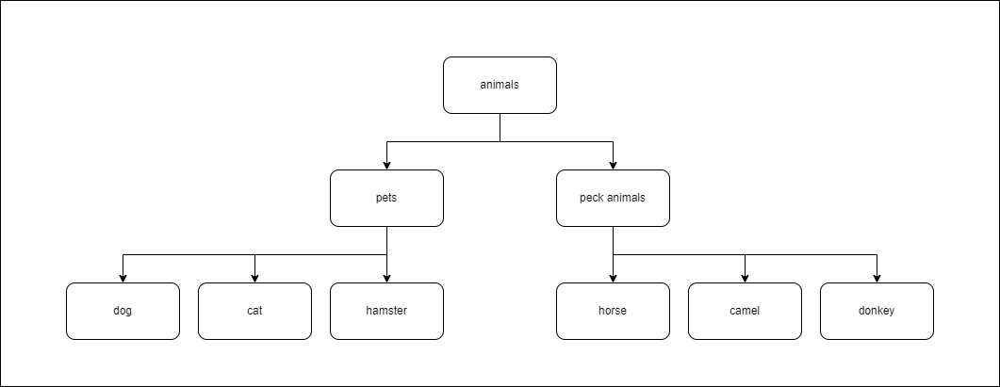

# Итоговая контрольная работа по блоку специализация
## Задание
### 1 - 5 
[ссылка]()
```
cat > pets.txt
cat > pack_animals.txt
cat pack_animals.txt pets.txt > animals.txt
cat animals.txt

Вывод:
        camel
        hors
        donkey
        dog
        cat
        hamster

mv animals.txt human_friends.txt 
mkdir animals
mv human_friends.txt animals/ 

sudo apt update
sudo apt install mysql-server mysql-client

sudo apt download zip
sudo dpkg -i zip_3.0-12build2_amd64.deb
sudo dpkg -r --force-depends zip
```

# 6



# 7 - 12
[ссылка]()
```
drop database if exists HumanFriends;
create database HumanFriends;
use HumanFriends;

drop table if exists Animals;
create table Animals(
	id int auto_increment primary key,
    classAnimal varchar(45) not null);
    
insert into Animals (classAnimal) values
('pets'),
('pack_animals');

drop table if exists Pets;
create table Pets(
	id int auto_increment primary key,
    classAnimal varchar(45) not null,
    typeAnimal varchar(45) not null);
    
insert into Pets (classAnimal, typeAnimal) values
('pets', 'dog'),
('pets', 'cat'),
('pets', 'hamster');

drop table if exists PackAnimals;
create table PackAnimals(
	id int auto_increment primary key,
    classAnimal varchar(45) not null,
    typeAnimal varchar(45) not null);
    
insert into PackAnimals (classAnimal, typeAnimal) values
('pack_animals', 'horse'),
('pack_animals', 'camel'),
('pack_animals', 'donkey');

drop table if exists Dog;
create table Dog(
	id int auto_increment primary key,
    typeAnimal varchar(45) not null,
    nameAnimal varchar(45) not null,
    BirthDate date not null,
    Commands text);
    
insert into Dog (typeAnimal, nameAnimal, BirthDate, Commands) values
('dog', 'miki', '2020-02-02', 'bark, down, up'),
('dog', 'leva', '2022-12-12', 'bark, down'),
('dog', 'tizik', '2015-05-05', 'down');

drop table if exists Cat;
create table Cat(
	id int auto_increment primary key,
    typeAnimal varchar(45) not null,
    nameAnimal varchar(45) not null,
    BirthDate date not null,
    Commands text);
    
insert into Cat (typeAnimal, nameAnimal, BirthDate, Commands) values
('cat', 'boris', '2017-01-20', 'jump'),
('cat', 'timi', '2022-01-13', 'bite'),
('cat', 'miysh', '2019-11-11', 'jump, bite');

drop table if exists Hamster;
create table Hamster(
	id int auto_increment primary key,
    typeAnimal varchar(45) not null,
    nameAnimal varchar(45) not null,
    BirthDate date not null,
    Commands text);
    
insert into Hamster (typeAnimal, nameAnimal, BirthDate, Commands) values
('hamster', 'vini', '2023-12-31', 'eat'),
('hamster', 'pooh', '2013-11-30', 'sleep');

drop table if exists Horse;
create table Horse(
	id int auto_increment primary key,
    typeAnimal varchar(45) not null,
    nameAnimal varchar(45) not null,
    BirthDate date not null,
    Commands text);
    
insert into Horse (typeAnimal, nameAnimal, BirthDate, Commands) values
('horse', 'botsman', '2023-04-04', 'brrr, jump'),
('horse', 'molniya', '2015-12-25', 'run'),
('horse', 'johan', '2012-07-07', 'run');

drop table if exists Camel;
create table Camel(
	id int auto_increment primary key,
    typeAnimal varchar(45) not null,
    nameAnimal varchar(45) not null,
    BirthDate date not null,
    Commands text);
    
insert into Camel (typeAnimal, nameAnimal, BirthDate, Commands) values
('camel', 'vasya', '2017-06-06', 'run, down'),
('camel', 'kolay', '2024-01-08', 'jump'),
('camel', 'martin', '2008-08-04', 'down');

drop table if exists Donkey;
create table Donkey(
	id int auto_increment primary key,
    typeAnimal varchar(45) not null,
    nameAnimal varchar(45) not null,
    BirthDate date not null,
    Commands text);
    
insert into Donkey (typeAnimal, nameAnimal, BirthDate, Commands) values
('donkey', 'ishak', '1989-04-01', 'go, brr'),
('donkey', 'conor', '2023-06-27', 'brr, run');

/** 10. Удалив из таблицы верблюдов, т.к. верблюдов решили перевезти в другой
питомник на зимовку. Объединить таблицы лошади, и ослы в одну таблицу. **/

delete from Camel
where typeAnimal = 'camel';

create table HorseAndDonkey
select * from Horse
union
select * from Donkey;

/** 11.Создать новую таблицу “молодые животные” в которую попадут все
животные старше 1 года, но младше 3 лет и в отдельном столбце с точностью
до месяца подсчитать возраст животных в новой таблице **/

create table YoungAnimals
select * from Dog
where TIMESTAMPDIFF(month, BirthDate, now()) > 12 and TIMESTAMPDIFF(month, BirthDate, now()) < 36
union select * from Cat
where TIMESTAMPDIFF(month, BirthDate, now()) > 12 and TIMESTAMPDIFF(month, BirthDate, now()) < 36
union select * from Hamster
where TIMESTAMPDIFF(month, BirthDate, now()) > 12 and TIMESTAMPDIFF(month, BirthDate, now()) < 36
union select * from Horse
where TIMESTAMPDIFF(month, BirthDate, now()) > 12 and TIMESTAMPDIFF(month, BirthDate, now()) < 36
union select * from Camel
where TIMESTAMPDIFF(month, BirthDate, now()) > 12 and TIMESTAMPDIFF(month, BirthDate, now()) < 36
union select * from Donkey
where TIMESTAMPDIFF(month, BirthDate, now()) > 12 and TIMESTAMPDIFF(month, BirthDate, now()) < 36;

select *, TIMESTAMPDIFF(month, BirthDate, now()) as AgeMonth from YoungAnimals;

/** 12. Объединить все таблицы в одну, при этом сохраняя поля, указывающие на
прошлую принадлежность к старым таблицам. **/

create table AllTypes
select * from Pets
union
select * from PackAnimals;

select * from AllTypes;

create table AllAnimals
select * from Dog
union select * from Cat
union select * from Hamster
union select * from Horse
union select * from Camel
union select * from Donkey;

select * from AllAnimals
right join AllTypes
on AllAnimals.typeAnimal = AllTypes.typeAnimal;
```


### 13 - 15
[ссылка]()